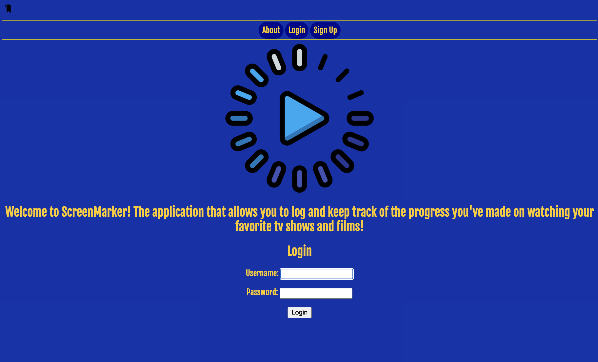

# Screen-Marker

Welcome to my application, ScreenMarker! The app that lets you keep track of the progress you've made in your backlog of Movies and TV shows.

### Getting started

Click [here](https://screenmarker.herokuapp.com/) to start the application. You must login before utilizing the feature.

Trello board located [here](https://trello.com/b/NJQp6gF7/screenmarker)

### Technologies used

- Python
- Django
- CSS
- HTML
- Flexbox
- PostgreSQL

### Moving Forward

- Implement an API so users can search for movies to add to their collection
- Add Boolean Fields to the Show model in order to check whether a series is still ongoing, and to check if the user has completed watching
- Change runtime and timestop in the Show model from CharFields to Timefields so users can easily input where they left off